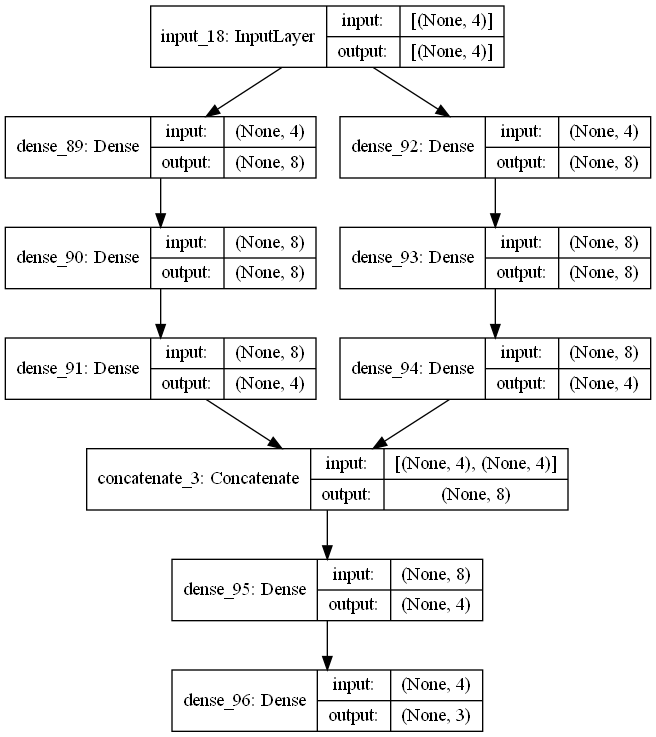

# Study of Machine-Learning

> **AUTHOR** : HoHyun Cha (ghgus2006@naver.com)  
> **DATE** : '22.10/13

### Reference

- [Github - Chahohyun [Neural Net Study]](https://github.com/ChaHoHyun/Neural_Net_Study)
- [Github - Sungwookle [CNN]](http://sungwookle.site/research/2106211010/)
- [How to Calculate Hidden Layer's Backpropagation](https://bskyvision.com/718)
- [About Activation Function](https://deepinsight.tistory.com/113)
- [About Gradient Descent](https://angeloyeo.github.io/2020/08/16/gradient_descent.html)
- [Funtional API vs Sequential API Wikidocs](https://wikidocs.net/38861)

### Index

1. [Single / Hidden-Layer Perceptron](#1-perceptron)<br>
   [1-4] [Functional API](#1-4-funtional-api)
2. [CNN]()


<br>

### 1. Perceptron
<br>

#### [1-1] Single Neuron

A single-layer neural network represents the most simple form of neural network, in which there is only one layer of input nodes that send weighted inputs to a subsequent layer of receiving nodes, or in some cases, one receiving node.
<br>

#### - Proof Reference
<br>

- MD file and Python code file is [[Github] URL hear](https://github.com/ChaHoHyun/Neural_Net_Study/blob/main/Summary_study_Neural_Net.md)

<br>
<center></center>

<center>[Human Brain vs Deep Learning]</center>
<br>

<center></center>
<center>[Single Hidden Layer Neural Network]</center>
<br>

- [Example Code](./dl_algorithm/perceptron.ipynb)

- Limitation
<br>

<center></center>
<center>[XOR Problem]</center>

#### [1-2] Hidden Layer
<br>

By adding hidden layer composed of several perceptrons to an artificial neural network, the accuracy and complexity is much improved *only training set*. = We can classifier Label by a lot of line by creating hidden layer.

<center></center>
<center>[More Hidden layer diagram]</center>
<br>

- Activation Function : A function that converts the sum of input signals into output signals
   - Softmax : 

<center></center>
<center>[Sort of Activation Functions]</center>

In fact, the most used is `ReLU`. <br>
Why? Because of **Back-Propagation (Gradient Vanishing)**. Through backpropagation we update the weights and biases, using the derivative of the cost function. However the derivative function of sigmoid has a value of 0 in a specific interval, causing a problem in that the update amount is lost. In other words, there is a problem in that learning cases at certain moment.

<br>

- Cost Function : the overall degree of error that exists in the training data.
   - MSE (Mean Squared Error) : $\frac{1}{n} \sum \limits_{i=1}^{n} ((y_{i} - \hat{y_{i}})^2)$
   - Binary Cross-entropy : $-\frac{1}{n} \sum \limits_{i=1}^{n} (y_{i} \cdot log(\hat{y_{i}}) +(1-y_{i}) \cdot log(1-\hat{y_{i}}))$

- Gradient Descent(Optimizer) : How to find the optimized parameter that minimizes the cost value of the `cost function`<br>

   $\theta_{Update} =  \theta_{Old} - η \cdot \frac {\partial J(\theta_{0}, \theta_{1})}{\partial \theta_{j}}$<br>
   $η = Learning Rate$<br>
   - Precautions<br>
      1) Appropriately sized Learning Rate<br>
      
      2) local minima problem<br>
      
   
   <br>

   - Sort of Gradient Descent<br>
      <center></center>
      <center>[Sort of Gradient Descent]</center>

      1. Terms<br>

         - Batch Size : The number of data to learn at once when updating<br>
         - Epoch : The number of times the entire training dataset has passed through the neural network<br>
         - Iteration : Number of times updated within 1 epoch
         
         <br>
         <center></center>
         <center>[Batch Size vs Epoch vs Iteration]</center>

      2. Optimizer
         - GD(gradient descent) : It's a method of calculating using **all the data**
         - SGD(Stochastic gradient descent) : 확률적 경사 하강법. It is a method of randomly extracting a data and updating the weight itself.
         
         <br>
         <center></center>

         - Momentum :  It is a method of using momentum.
         - **Adam(Adaptive Moment Estimation)** : Popular optimizer

         <center></center>
<br>

#### [1-3] Deep Neural Net
<br>

1. Concept
- Single Perceptron : Classification / Regression like Machine Learing
- Multi-Layer Perceptron : `Single Perceptrion` + Non-linearity(XOR) + Back-Propagation(Increasing Accuracy)
- Deep Neural Net : `Multi-Layer Perceptron` + More deeper network(Increasing Accuracy) + Relu & Drop-Out(Prevent Overfitting)<br>

2. [Example code + Funtional API](./dl_algorithm/Multi_Layer_Perceptron.ipynb)

<br>

#### [1-4] Funtional API
<br>

1. Sequetial API Example
```python
model = models.Sequential([
    layers.Dense(units = 10, activation='sigmoid', input_shape = x_train[0].shape),
    layers.Dense(units = 6, activation='sigmoid'),
    layers.Dense(units = 1, activation='linear')
])
```
2. Funtional API Example
```python
inputs = Input(x_train[0].shape)
x1 = layers.Dense(units = 10, activation = 'sigmoid')(inputs)
x2 = layers.Dense(units = 6, activation = 'sigmoid')(x1)
outputs = layers.Dense(1, activation = 'linear')(x2)
```
3. Why we use `Funtional API`?
- Sequential APIs have limitations in creating **complex models**, such as sharing multiple layers or using different types of inputs and outputs. Now let's see Functional APIs (API) code, a way to create more complex models.

```python
inputs = Input(x_train[0, :4].shape)
x1 = layers.Dense(8, activation='sigmoid')(inputs)
x1 = layers.Dense(8, activation='sigmoid')(x1)
x1 = layers.Dense(4, activation='sigmoid')(x1)

x2 = layers.Dense(8, activation='sigmoid')(inputs)
x2 = layers.Dense(8, activation='sigmoid')(x2)
x2 = layers.Dense(4, activation='sigmoid')(x2)

x = layers.concatenate([x1,x2])
x = layers.Dense(4, activation='sigmoid')(x)
outputs = layers.Dense(3, activation = 'softmax')(x)

model = Model(inputs = inputs, outputs = outputs)
```
<center>
 <br>
[Funtional API vs Sequential API]
</center>
<br>

#### [1-5] [Example code](./dl_algorithm/Multi_Layer_Perceptron.ipynb)
<br>
- Multi-Layer Perceptron + Functional API

<br>

$y_{i} = \beta_{0} + \beta_{1}x_{i}+\epsilon_{i}$<br>
$\epsilon_{i} = y_{i}-\beta_{0} - \beta_{1}x_{i}$
 > LSE → $MinS^2 = Min \sum \limits_{i=1}^{n} \epsilon_{i}^2 = Min \sum \limits_{i=1}^{n} (y_{i}-\beta_{0} - \beta_{1}x_{i})^2$

 - condition<br>
 
    1) $f^\prime(x) = 0$ 
       -  $\beta_{1} = \frac{\sum \limits_{i=1}^{n}(x_{i}-\bar{x})(y_{i}-\bar{y})}{\sum \limits_{i=1}^{n}(x_{i}-\bar{x})^2} = \frac{Cov(X,Y)}{Var(X)}$
       -  $\beta_{0} = \bar{y} - \beta_{1}\bar{x}$
       
       <br>
    2) $f''(x) > 0$ => $Satisfied$