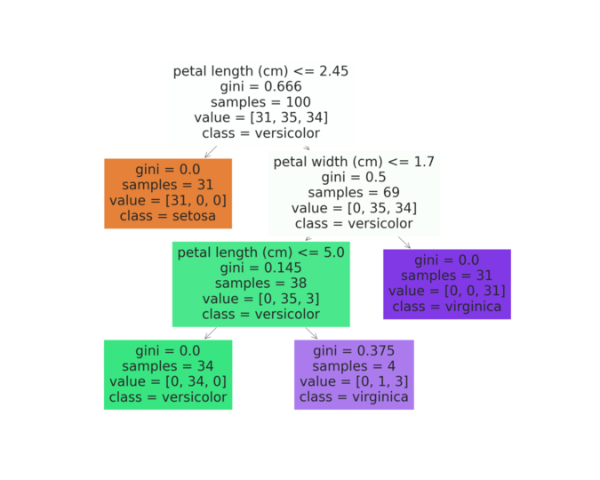

# Study of Machine-Learning

> **AUTHOR** : HoHyun Cha (ghgus2006@naver.com)  
> **DATE** : '22.8/8

### Reference

- [Scikit-learn Official Document](https://scikit-learn.org/stable/)
- [Derivation of LSE](https://datalabbit.tistory.com/49)
- [Linear Classification](https://medium.com/elice/%EC%BB%B4%EA%B3%B5%EC%83%9D%EC%9D%98-ai-%EC%8A%A4%EC%BF%A8-%ED%95%84%EA%B8%B0-%EB%85%B8%ED%8A%B8-%E2%91%A1-%EC%84%A0%ED%98%95-%EB%B6%84%EB%A5%98-%EB%AA%A8%EB%8D%B8-linear-classification-model-93ba8c8fd249)
- [Gaussian Mixture Model](https://angeloyeo.github.io/2021/02/08/GMM_and_EM.html)
- [Data Scaling](https://dacon.io/codeshare/4526)
- [K-Nearest Neighbor](https://dacon.io/codeshare/4526)
- [What is Ensemble Learning](https://www.projectpro.io/article/a-comprehensive-guide-to-ensemble-learning-methods/432#toc-3)
- [Boosting - GBM & XGBoost & LightGBM](https://velog.io/@dbj2000/ML)
- [kaggle Titanic Example - Sungwookle](http://sungwookle.site/research/2106211010/)

### Index

1. [Linear Regression](#1-linear-regression)
2. [KMeans](#2-kmeanskmm-k-means-clustering)
3. [GMM](#3-gmm-gaussian-mixture-model)
4. [PCA / LDA](#4-pca--lda) 
   4-3. [Scaler](#4-3-scaler)
5. [KNN](#5-knn-k-nearest-neighbors) 
   5-1. [Cross Validation](#5-1-cross-validation) 
   5-2. [Grid Search](#5-2-grid-search)
7. [DecisionTreeClassifier](#7-decisiontreeclassifier) 
   7-1. [Ensemble Learning](#7-1-ensemble-learning) 
   7-2. [Bagging Classifier](#7-2-bagging-classifier) 
   7-2. [1] [Random Forest](#7-2-1-random-forest) 
   7-3. [Voting Classifier](#7-3-voting-classifier) 
   7-4. [Boosting](#7-4-boosting)
   

 

### Choosing Model

 

[[reference] Choosing the right estimator - Sklearn](https://scikit-learn.org/stable/tutorial/machine_learning_map/)
  

### 1. Linear Regression
 

 Linear regression is perhaps one of the most well known and well understood algorithms in statistics and machine learning. It is one of the Supervised Learning and regression problem since the value that i want to estimate is the real value.

- A type of Supervised Learning
- Linear Regression is based on **LSE**(Least Square Error), which can minimize loss.

 1-1) Concept : If we can assume that there is a <u>**linear relationship**</u> between X (input) and y (Lable), we can find the weight and bias of the **linear** regression relationship. ↔ **Logistic Regression**

 1-2) Hypothesis : $H_(x) = Wx + b$

 1-3) Cost Function : LSE [here](#1-1-proof-of-linear-regression)

 

[Figure of Linear Regression]

#### [1-1] Proof of Linear Regression

We can derive Linear Regressiom as below. 
[Reference - Proof of Linear Regerssion](https://datalabbit.tistory.com/49)

$y_{i} = \beta_{0} + \beta_{1}x_{i}+\epsilon_{i}$ 
$\epsilon_{i} = y_{i}-\beta_{0} - \beta_{1}x_{i}$
 > LSE → $MinS^2 = Min \sum \limits_{i=1}^{n} \epsilon_{i}^2 = Min \sum \limits_{i=1}^{n} (y_{i}-\beta_{0} - \beta_{1}x_{i})^2$

 - condition 
 
    1) $f^\prime(x) = 0$ 
       -  $\beta_{1} = \frac{\sum \limits_{i=1}^{n}(x_{i}-\bar{x})(y_{i}-\bar{y})}{\sum \limits_{i=1}^{n}(x_{i}-\bar{x})^2} = \frac{Cov(X,Y)}{Var(X)}$
       -  $\beta_{0} = \bar{y} - \beta_{1}\bar{x}$
       
        
    2) $f''(x) > 0$ => $Satisfied$

    

[Minimizing the Error function]

 

#### [1-2] Example code

Python code file is [hear](./ml%20algorithm/linear_regression.ipynb)

### 2. Kmeans(KMM, K-means clustering)

 The goal of this algorithm is to find groups in the data, with the number of groups represented by the **variable K**. The algorithm works iteratively to assign each data point to one of K groups based on the features that are provided. Data points are clustered based on feature similarity.

- A type of Unsupervised Learning (Non-Label)

 1-1) Concept : Clustering according to the number(k) of each data group

  ※ <u>**Scaler Required**</u>

 

[Example of Clustering]

 

 1-2) Example 
     - Recommendation Engine: Tie up similar products to personalize the user experience  
     - Search engine: Tie related topics or search results  
     - Segmentation: Tie up similar customers according to region, demographics, and behavior  

 1-3) Theory 
1. Decide K arbitrary center points(centroids)
2. Devide each data in the group to which the nearest centroids belong
3. Update the center point of each cluster based on the data belonging to each cluster 
4. Repeat steps 2. and 3. until the center point is no longer updated

 

[Process of KMeans Clustering]

 

#### [2-1] Example code

Python code file is [hear](./ml%20algorithm/kmeans.ipynb)

- how to build KMeans model
- how to set the K value? [Elbow method / Silhouette score]

#### [2-2] What is EM?

The EM algorithm is basically an algorithm mainly used for unsupervised learning. 
The EM algorithm can be divided into two stages: 1) E-step and 2) M-step.
In conclusion, it is a method of finding the optimal parameter value by repeating E-step and M-step.

 - E-step: Calculate the Likelihood value as close as possible to Likelihood from the initial value of any given parameter.
 - M-step : Obtain a new parameter value that maximizes the likelihood calculated in E-step.
 - Repeat the above two steps continuously until the parameter value does not changed.
   
   ※ MLE(Maximum Likelihood Estimation)? 
     To estimate the maximizing probability p(x) in a probability density function of an event we do not know. 
     > Ex) What is the probability that if a coin is thrown 1,000 times and the front is 600 times?   → We'll say 0.6, which we can say on the based on the MLE.

 

### 3. GMM (Gaussian Mixture Model)

To cluster data under the assumption that it is a mixture of data sets with multiple Gaussian distributions.

- A type of Unsupervised Learning
- What is Gaussian distributions? (Gaussian = Normal distribution) :  
  The distribution of the data is symmetrically represented by the mean value

[Gaussian/Normal Distribution]

 

[Gaussian Mixture Model]

 - Different with KMeans : GMM is probability-based clustering and K-Means is distance-based clustering. Therefore, K-Means is a method of clustering while moving the center on a distance-based, which is more effective when the data within an individual cluster are distributed into a circle.(↔ GMM : Ellipse)

 

[GMM vs KMeans]

[Reference] [News on the Development of Kakao Speaking Recognition Using GMM](https://papago.naver.com/)

#### [3-1] Theory

 

1) Set randomly number of 'n_component' Gaussian distributions when we do not know abount the label. Through two given Gaussian distribution above figure, it is possible to decide Label for all data samples.

 

2) The above results can be obtained through process of 1).

 

3) If the Gaussian distribution is drawn again as a result 2) labeling , it will be like above.

 

4) Repeat n times until not changing.

 

 

#### [3-2] Example code

Python code file is [hear](./ml%20algorithm/GMM.ipynb)

- KMeans vs GMM

 

### 4. PCA & LDA
 

#### 4-1. PCA

 
1) PCA(Principal Component Analysis) : How to find the most similar lower dimension data from higher dimension data(=dimension reduction)
 → Therefore, PCA is mainly used to model with new variables by combining existing variables when there are too many dimensions. 

- Dimension reduction techniques applied in Unsupervised Learning

 

[Description of PCA]

  1-1) Why reduce dimensions(PCA)? 
  -  Feature Selection : It is determined through the correlation coefficient value, and unnecessary features are discarded.
  - Feature Extraction 
  - Feature Generation : New features are created from the data and the purpose of machine learning algorithm.

  1-2) Caution
   - Since PCA uses a covariance matrix, it requires a process of **Scaler** each feature data with different units and distributions.
   - n_components == min(n_samples, n_features)
   - Usually, the accuracy is less than before. because the number of data decreases due to dimensions shrinking.

#### 4-2. LDA

1) LDA (Linear Discriminant Analysis) : Dimension reduction techniques similar to PCA

- Dimension reduction techniques applied in Supervised Learning
- Finding the axis that maximizes class(Label) separation

 

[Comparision PCA vs LDA]

##### [4-2-1] Example Code
 

PCA + LDA's Python code file is [hear](./ml%20algorithm/PCA_LDA.ipynb)

 

#### 4-3. Scaler
 

- One of Data-Preprocessing

- Each feature has its own range of data values. so if the range difference is large, it can converge to zero or diverge indefinitely when learning the model with the data.
   - Therefore, scaling allows you to adjust the data distribution or range of all features equally.

##### [4-3-1] Example Code

 

Python code file is [hear](./ml%20algorithm/Scaler.ipynb)

 

### 5. KNN (K-Nearest Neighbors)

 

1) Concept

Finding the 'nearest neighbor' is the model's prediction method (Classification).

- A type of Supervised Learning
- Need to apply Scaler Since it is judged on the basis of distance of each data.
- How to set k-values?

 

2) Theory 

   1. Calculate the distance between the new instance(Data to be predicted) from the known data
   2. Count the classes of the K Nearest Neighbors
   3. Classify the instance based on the majority of classes obtained in the previous step 
   4. Repeat steps 2. and 3. for all data(new instance)

 

[Process of KNN]

 

#### [5-1] Cross Validation

- The most common strategy for judging the performance of a ML model is to divide the data-set into a training set and a validation set (at a rate of 70-80%) => **Holdout method** 
    - example : Get performance Split 5 only (below figure1)
    - problem : Datasets(not split5) might be possible to have a poor performance. So, we couldn't decide ML model by Holdout method score.

 

##### [5-1-1] K-fold Cross Validation
 
 - We can handle the problem mentioned above with K-fold cross validation.The dataset is divided into K pieces and the ML performance evaluation of k times is conducted. (The figure below shows K-fold cross validation with k value of 5) 
 - By evaluating all Train-Set, we can generalize the performance of the model.

 

[figure1] simple diagram of K-fold Cross Validation

 

- Conclusion : We have to divide the data-set into three types: <u>**train, validation, and test**</u>.

 

#### [5-2] Grid Search
 
 Grid-search provides the best parameters by sequentially entering hyperparameters used in classification or regression algorithms, learning and measuring. 

 

##### [5-2-1] GridSearchCV

 - A <u>total</u> search for the parameter values specified for the estimator

##### [5-2-2] RandomizedSearchCV

 - <u>Randomized</u> search for hyper parameters
 - **Unlike GridSearchCV**, not all parameter values are attempted, but a fixed number of parameter settings are sampled from the specified distribution. The number of parameter settings attempted is provided by `n_iter`.

 

[Diagram of Grid Search]

 

#### [5-3] Example code

Python code file is [hear](./ml%20algorithm/KNN_Cross_Validation_Grid_Search.ipynb)

- how to build KMeans model
- how to set the K value? [Elbow method / Silhouette score]

 

### 6. NBC

### 7. DecisionTreeClassifier

 

- A type of Supervised Learning
- Express diagram of DecisionTree by `dtreeviz/graphviz` and so on. 
   - [[URL] Decision-Tree Visualization](https://mljar.com/blog/visualize-decision-tree/)
 

   

- Easy to be **overfitting** ↔ RandomForest(DT + Bagging)

 

> class sklearn.tree.DecisionTreeClassifier(*, criterion='gini', splitter='best', max_depth=None, min_samples_split=2, min_samples_leaf=1, min_weight_fraction_leaf=0.0, max_features=None, random_state=None, max_leaf_nodes=None, min_impurity_decrease=0.0, class_weight=None, ccp_alpha=0.0)

- criterion : 분할 품질을 측정하는 기능 (default : gini)
- max_depth : 트리의 최대 깊이 (값이 클수록 모델의 복잡도가 올라간다.)
- max_features : 각 노드에서 분할에 사용할 특징의 최대 수
- max_leaf_nodes : 리프 노드의 최대수

   [[Reference] DecisionTreeClassifier Hyperparameter](https://inuplace.tistory.com/548)

 

#### [7-1] Ensemble Learning

 

Ensemble Learning is the process where multiple machine learning models are combined to get better results. The core idea is that the result obtained from a combination of models can be more accurate than any individual machine learning model.

- Why we use Ensemble model? **Because it's powerful!**  
  Enemble shows better performance by merging each ML model that has lower performance.

 

#### [7-2] Bagging Classifier

 

- <u>A single ML model</u> learns to make individual predictions on a data-set sampled by **bootstrapping** and selects the final prediction result through voting
- Bagging : Bootstrap & Aggregation
   - Bootstrap : To extract N samples with **restore extraction** N times ↔ K-fold
   - Aggregation : Vote individual predictions (result : **value average**) to select final prediction results
- Representative model
   - **RandomForest**
   
    
 - Steps 

   1. Create multiple data instances by dividing train data (bootstrapping)

   2. Create multiple models from this bootstrap data and multiple model outputs. Aggregate the results of the model and obtain the final results.

 

Diagram of Bagging Classifier

 

##### [7-2-1] Random Forest
 

- Random Forest : Ensemble(Bagging type) of DecisionTree 
- Sampling both train data and feature → Lower **Overfitting** 
- Take large number of decision trees (`n_estimators : int`, default=100)

 

Diagram of Random Forest

 

 

#### [7-3] Voting Classifier
 
- <u>Multiple different ML model</u> learn about the same data-set and vote to select the final prediction result with prediction results 
- Voting Classifiers refers to the "multiple classification", 
which can be divided in two methods : <u>Hard Voting Classifier and Soft Voting Classifier</u>

 

   - Hard Voting Classifier : Create multiple ML models and compare their performance about results. At this time, the result of the classifier is aggregated and the class that gets the most votes is determined as the final predicted value is called the Hard Voting Classifier. → **Majority  Vote**

 

[figure2] Diagram of Hard Voting Classifier

 

   ※ Conclusion : As shown above [figure2], the **final result**(prediction) of the Hard Voting Classifier will be <u>**1**</u> because there are three models that predict the final result as 1 and only one model that predict the final result as 2.
 
 

   - Soft Voting Classifier : Use when all classifiers used in an ensemble can predict the probability of a class. The prediction for each classifier is averaged to predict the class with the highest probability. → **Weighted Vote**

 

[figure3] Diagram of Soft Voting Classifier

 

$p(i=1 | x) = \frac{(0.9 + 0.8 + 0.3 + 0.4)}4 = 0.6$
$p(i=2 | x) = \frac{(0.1 + 0.2 + 0.7 + 0.6)}4 = 0.4$

 

  ※ Conclusion : As shown above [figure2], the class with a high mean for the prediction probability (**Label 1**) is set as the final prediction class.

 

#### [7-4] Boosting

- To learn by **more weighting** <u>the next model</u> for incorrectly classified result values in the previous model (weak learner)
- Although **Bagging** is independent of individual models (but not completely with the same base estimator) ↔ **Boosting** is a <u>sequential Multiple classifier model</u>
- Representative model
   - Adaboost
   - Gradient boosting
      - XGBoost (https://velog.io/@dbj2000/ML)
      - LightGBM (more quick speed than XGBoost)
      - GBM (Gradient Boost Machine)
 

##### [7-4-1] GBM
 

- GBM : Gradient Boosting Machine
- GBM uses a **gradient descent method** for weight updates
- Hyperparameter Tunning
   - n_estimators, max_depth, Max_features : Number of trees
   - loss : Select Cost Function {‘log_loss’, ‘deviance’, ‘exponential’}
   - learning_rate : The coefficient applied by learner to correct the error values sequentially
   - subsample : Proportion of data used for learning

 

##### [7-4-2] XGBoost
 

- XGBoost : eXtra Gradient Boost → Tree-based ensemble learning.
- Advantage

|List|Content|
|:---:|:---:|
|Good Performance|Typically excellent predicton at classification and regression|
|Quick running time than GBM|Parallel execution and many functions ↔ Gradient Descent|
|Regulation in Overfitting|A function|

 

#### [7-5] Example code

Python code file is [hear](./ml%20algorithm/DecisionTree.ipynb)
